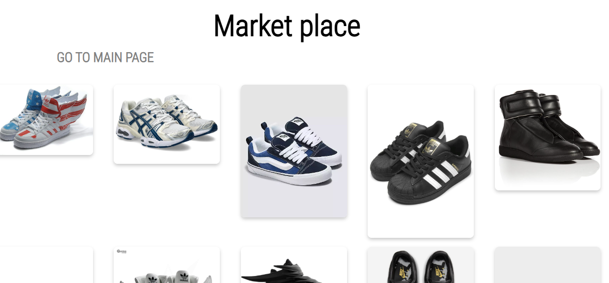

# My First Website Using Flask

## Description

The main goal of this project was to gain first-hand experience with Flask and SQL databases.  
Using these tools, I created a small web application. I spent most of the time building a solid backend structure, allowing for potential future growth.

Jinja inheritance was used to make HTML templates more scalable.  
In the future, I plan to integrate JavaScript in a more meaningful way — currently, it's only used for basic logging.

The website itself is a **simple footwear marketplace**.

## Main Scripts of the Application

- **app.py** – Implements route handling for the web pages with GET and POST support, along with a few simple algorithms.
- **sql_handler.py** – A helper class for working with SQLite3 and executing SQL queries in a clean way.
- **new.db** – The main database containing tables for users and products.

Project files follow the standard structure with separate folders for:

- **`templates/`** – HTML files using Jinja2.
- **`static/`** – CSS, JavaScript, and images.
